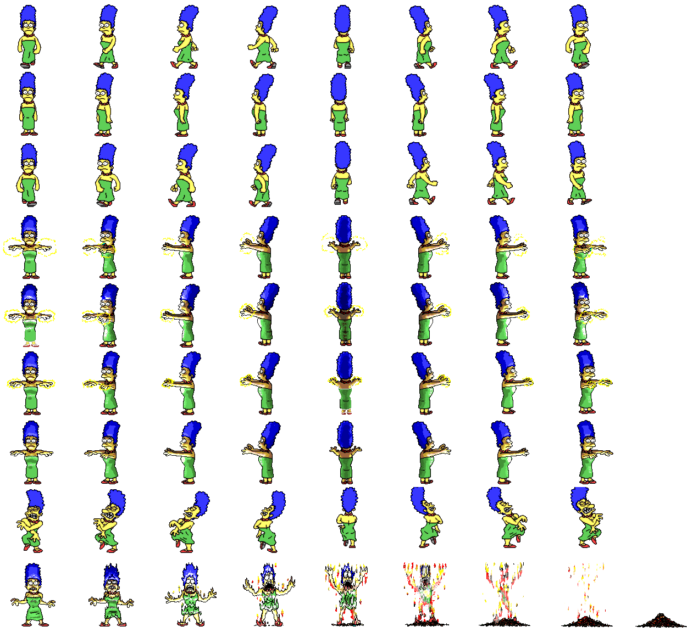

# <p align="center">👶 Kidiot ⚡</p>

<p align="center">
    
</p>

## 📋 Table of contents
<details>
<summary>Click to reveal</summary>

- [About](#-about)
- [Requirements](#-requirements)
- [Building](#-building)
- [Usage](#-usage)
- [Author](#-author)

</details>

## 🔍 About

Can also be found at https://github.com/NairodGH/Kidiot

Kidiot is a Game Jam project I've coded back in 2022 for school with Xavier TONNELLIER.\
It is a 2D [Who's your daddy](https://en.wikipedia.org/wiki/Who's_Your_Daddy%3F_(video_game)) made in C with [Raylib](https://www.raylib.com/) for Linux.

## 💻 Requirements

You will need:
- [CMake](https://cmake.org/)
- A compiler for CMake to build the executable on Linux (usually GCC or Clang is already present)

## 🔧 Building

```
mkdir build
cd build
cmake ..
cmake --build .
./kidiot [width] [height] [gametime]
```

## 🎮 Usage

As the baby:
- Controls = WASD equivalent for movement and Spacebar to interact
- Bathtub = press once to fill up then stay 4secs in it to drown
- Cactus = press once to take 10 damage, 5secs cooldown
- Electric outlet = stay on it for 5secs to electrocute
- Fridge = press once to open and stay in it to take 20 damage per second
- Microwave = press once to open then stay 3secs in it to gain a speed boost
- Oven = press once to open then stay 3secs in it to take 5 damage per second
- Vacuum cleaner = press once to vacuum the mom into it for 3secs no matter where she was
- WC = press once to teleport to the other toilet

As the mom:
- Controls = arrows for movement and Enter to interact
- Bathtub = press once on it to empty the bath
- Cactus = press once on it to cut it (disables it)
- Electric outlet = press once on it to cancel the baby's electrocution
- Fridge = press once on it to cancel the baby's freeze
- Microwave = press once on the baby to cancel its speedboost
- Oven = press once on the baby to extinguish it
- WC = press once on it (disables it but not the other one)

```first_floor.txt``` and ```second_floor.txt``` are available in map/ where:
```
b = baby spawn point
m = mom spawn point
# = Wall
+ = Invisible collision box (for big sprites like Table)
  = Ground
B = Bathtub
C = Cactus
E = Electric outlet
F = Fridge
M = Microwave
O = Oven
T++ = Table (no interaction, collision)
S = Staircase
V = Vacuum cleaner
W = WC
Z = Zzz (no interaction, collision)
```

You can modify them as you please but keep the basics in place to not break it:
- 1 baby spawn point
- 1 mom spawn point
- walls surrounding the house (we did not make an open-world lmao)
- only 1 furniture of each type on both floors except:
  - unlimited cactus and electrical outlets
  - there can be 1 bathtub per floor
  - 1 WC downstairs if 1 WC upstairs and vice versa

## 🤝 Authors

[Nairod](https://github.com/NairodGH) • [Xavier TONNELLIER](https://github.com/XavTo)